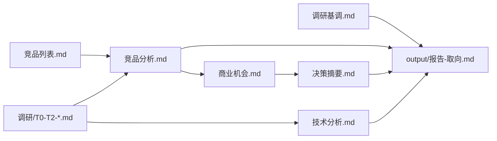

# 报告模板使用说明

本目录为 hardware-insight Step 8 的**最终报告骨架模板**。撰写 `research/<产品简称>/output/报告-<取向>.md` 时，须复制对应模板章节结构并填充内容。

## 模板清单

| 文件 | 取向 | 典型读者 |
|------|------|----------|
| [报告-决策导向.md](报告-决策导向.md) | 立项/路线决策 | 管理层、产品、技术规划 |
| [报告-科普导向.md](报告-科普导向.md) | 技术理解 + 对我方含义 | 产品、非研发干系人 |
| [报告-投资人导向.md](报告-投资人导向.md) | 市场窗口 + 风险回报 | 投资人、战略投资 |

## 立场与读者

**立场不由模板决定**，撰写前读取 `research/<产品简称>/调研基调.md`：

- `分析师立场`：用户自填（无默认组织）；值为「中立第三方」时启用中立模式
- `读者`：管理层 / 产品 / 研发 / 投资人
- `调研目的`：立项评估 / 技术选型 / 竞品对标 / 融资材料

| 立场 | 写作约束 |
|------|----------|
| 第一方（任意自述身份） | 竞品用威胁/机会/可借鉴；建议主语为我方主体 |
| 中立第三方 | 建议可写行业视角，须标注「中立分析」 |

## Step 4–7 源文件映射



### 撰写前综合阅读清单（硬规则）

撰写报告前**必须阅读**（不得仅从 `决策摘要.md` 派生）：

```
research/<产品简称>/调研基调.md
research/<产品简称>/竞品列表.md
research/<产品简称>/调研/T0-*.md（全部）
research/<产品简称>/调研/T1-*.md（全部）
research/<产品简称>/竞品分析.md
research/<产品简称>/技术分析.md
research/<产品简称>/商业机会.md
research/<产品简称>/决策摘要.md
```

### 章节 ↔ 源文件速查

| 报告章节（决策导向） | 主要源文件 |
|---------------------|------------|
| 执行摘要 | `决策摘要.md` |
| 调研背景与目的 | `调研基调.md` |
| 竞争态势与含义 | `竞品分析.md`、`调研/T0-*.md` |
| 技术路线与架构 | `技术分析.md` |
| 集成/方案对比 | `决策摘要.md` 方案选项 |
| 商业窗口 | `商业机会.md` |
| 产品定义与边界 | `决策摘要.md` 明确不做 |
| 路线图 | `决策摘要.md` 路线图 |
| 风险登记册 | `决策摘要.md` 主要风险 |
| 待证事项 | 各 `调研/*` §13 |

## 证据与时效格式

关键事实须标注：

```
[A/B/C] 内容（信息时效：YYYY-MM，来源 URL）
```

- [A] 官方/拆解/认证库 > [B] 权威媒体/供应商 > [C] 二手信息
- 现状类结论主信源须 ≤12 个月
- 超 24 个月单独用于现状时标 `待更新` 或 `历史参照，非现状`

## 可视化替代方案

**禁止**在最终报告中嵌入 `infographics/*.png`。用以下替代：

| 原信息图用途 | 报告内替代 |
|-------------|-----------|
| 竞品格局 | Markdown 对比表 + mermaid 赛道图 |
| 方案对比 | 方案选项表（来自决策摘要） |
| 技术路线 | mermaid 架构/数据流图 |
| 商业窗口 | 量化要点表 + 窗口期时间线 |

信息图（若 Step 8 用户选择生成）仅作 `output/infographics/` 参考，不写入报告正文。

## 报告质量 Rubric（Step 8 自检）

权威清单见 [references/report-synthesis.md](../../references/report-synthesis.md)「Step 8 质量闸门」。本处不重复维护。

## 多取向产出

用户可选多个取向。流程：

1. 先完成共用 `决策摘要.md`
2. 按各取向复制模板生成 `output/报告-<取向>.md`

多取向时结论不得矛盾。

## 相关文档

- [SKILL.md](../../SKILL.md)
- [references/report-synthesis.md](../../references/report-synthesis.md)
