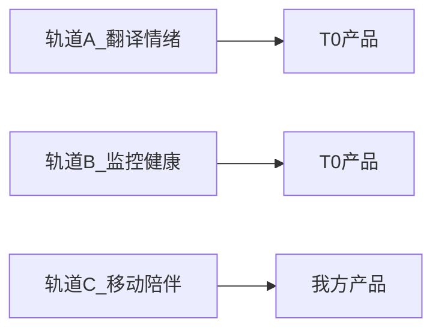
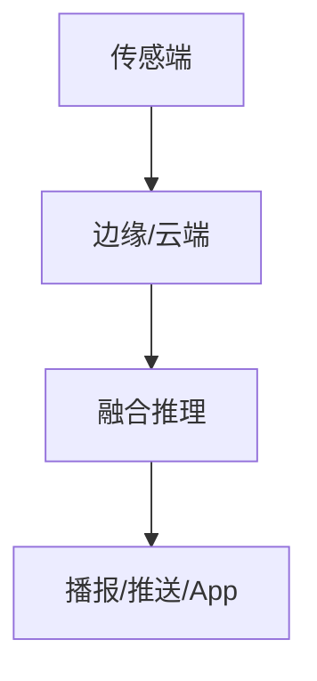

# [产品/课题名称] 调研报告（决策导向）

> 调研信息截止：YYYY-MM-DD | 分析师立场：[读取调研基调.md] | 读者：[读取调研基调.md]

---

<!-- 撰写说明：复制本文件结构到 research/<产品简称>/output/报告-决策导向.md，删除 HTML 注释块，填充 [占位符]。禁止嵌入 infographics/*.png。 -->

## 执行摘要

**本节目的**：一页内给出可行动的结论与建议，供决策层快速判断。

**必读源文件**：`决策摘要.md`、`调研基调.md`

**填写说明**：
- 首段：**结论**（1–2 句，直接回答调研目的核心问题）
- **建议**（1 句，主语为我方主体，除非中立第三方模式）
- **关键事实**：3–5 条，每条含 `[A/B/C]（信息时效：YYYY-MM，来源 URL）`
- 篇幅 ≤400 字（约 1 页）

**推荐结构**：

**结论**：[能否做 / 怎么做 / 是否必要 — 一句话]

**建议**：[我方主体] 应 [具体动作]，避免 [明确边界]。

**关键事实**：
- [事实 1 + 证据]
- [事实 2 + 证据]
- [事实 3 + 证据]

---

## 1. 调研背景与目的

**本节目的**：说明调研缘起与须回答的核心问题。

**必读源文件**：`调研基调.md`

**填写说明**：
- 引用 `调研基调.md` 中的产品、调研目的、范围、读者
- 列出 2–4 个须在本报告中回答的具体问题
- 1–2 段，不展开分析

**推荐结构**：

本调研回答以下问题（见 `调研基调.md`）：
1. [问题 1]
2. [问题 2]
3. [问题 3]

---

## 2. 竞争态势与对我方含义

**本节目的**：综合 T0/T1 竞品，分析格局并提炼对我方主体的威胁/机会/可借鉴点。

**必读源文件**：`竞品分析.md`、`竞品列表.md`、`调研/T0-*.md`、`调研/T1-*.md`

**填写说明**：
- 以**分析叙述**为主，避免仅复述调研表格
- 每个 T0 至少引用 1 次
- 含「对我方主体影响」判断（威胁/机会/无关/待观察）
- 用 mermaid 或表格呈现赛道/轨道划分（**替代信息图**）
- 不写技术实现原理（留给第 3 节）

**推荐表格**：

| 轨道/品类 | 代表产品 | 已验证价值 | 对我方影响 |
|-----------|----------|------------|------------|
| [轨道 1] | [T0 产品] | [证据] | 威胁/机会/待观察 |
| [轨道 2] | [产品] | [证据] | … |

**推荐 mermaid（竞品轨道）**：

**对我方含义**（专段，不可省略）：
- [威胁 1 + 应对思路]
- [机会 1 + 窗口说明]
- [可借鉴技术/体验 1]

---

## 3. 技术路线与架构选择

**本节目的**：给出推荐技术路径、架构与 Build/Buy/Partner 选择，说明弃选理由。

**必读源文件**：`技术分析.md`

**填写说明**：
- 引用 Step 5 架构分析，含 ≥1 张 mermaid 架构图或数据流图
- 含 **Build / Buy / Partner** 三栏对比（针对核心能力）
- 明确推荐路径与**弃选理由**（至少 1 条）
- 不写市场表现对比（已在第 2 节）

**推荐 mermaid（架构/数据流）**：

**Build / Buy / Partner**：

| 能力 | Build | Buy | Partner | 推荐（0–6月/6–18月/18–24月） |
|------|-------|-----|---------|------------------------------|
| [核心能力 1] | [优劣] | [优劣] | [优劣] | Partner → Buy → … |
| [核心能力 2] | … | … | … | … |

**弃选理由**：[不推荐的路径] — [原因 1]、[原因 2]

---

## 4. 集成方案对比

**本节目的**：对比可行方案选项，标注推荐项与决策依据。

**必读源文件**：`决策摘要.md`（方案选项表）

**填写说明**：
- 直接引用或精简 `决策摘要.md` 方案选项表
- 用 ★ 或「推荐」标注首选方案
- 每项含优势/劣势/风险至少各 1 条
- 可用 Markdown 表替代信息图方案对比

**推荐表格**：

| 选项 | 描述 | 推荐度 | 理由摘要 | 主要风险 |
|------|------|--------|----------|----------|
| A. [不结合/维持现状] | [描述] | ★ / ★★ / ★★★ / ❌ | [1 句] | [风险] |
| B. [推荐方案] | [描述] | **★★★** | [1 句] | [风险] |
| C. [备选] | [描述] | ★★ | [1 句] | [风险] |
| D. [弃选方案] | [描述] | ❌ | [弃选理由] | [风险] |

---

## 5. 商业窗口

**本节目的**：判断市场时机、规模参照与「是否有必要」结合/投入。

**必读源文件**：`商业机会.md`、`决策摘要.md`

**填写说明**：
- 含量化字段：市场规模引用、价格带、窗口期（均带证据等级）
- 回答「是否有必要」— 附条件判断（若…则必要；否则不必要）
- 引用已验证商业模式案例（如监控订阅 vs 话题热度）
- 1–2 段叙述 + 要点表

**推荐表格**：

| 维度 | 数据/判断 | 证据 |
|------|-----------|------|
| 市场规模/TAM | [数字或区间] | [A/B/C] YYYY-MM |
| 窗口期 | [开放/收窄/已过] | [依据] |
| 必要性判断 | 必要 / 有条件必要 / 非必要 | [战略条件] |

---

## 6. 产品定义与体验边界

**本节目的**：明确做/不做/命名规范，防止范围蔓延。

**必读源文件**：`决策摘要.md`（建议方向、明确不做）

**填写说明**：
- **做**：分层能力清单（L1/L2/L3 或等价层级）
- **不做**：来自 `决策摘要.md` 明确不做清单
- **命名规范**：对外可用表述 vs 禁用表述
- 主语为我方主体

**推荐结构**：

**做**：
- L1 [能力]（[现状：已有/规划中]）
- L2 [能力]（[依赖：PoC/Partner]）
- L3 [能力]（[须 gate：评测/合规]）

**不做**：
- ❌ [边界 1]
- ❌ [边界 2]

**命名规范**：使用「[推荐表述]」，禁用「[禁用表述]」。

---

## 7. 路线图

**本节目的**：给出 0–6 / 6–18 / 18–24 月里程碑、依赖与 gate。

**必读源文件**：`决策摘要.md`（路线图、资源粗估）

**填写说明**：
- 三阶段里程碑表
- 每阶段含 **gate**（Go/No-Go 条件）
- 资源粗估：人月量级或依赖团队
- 与量产/上市节奏对齐（若适用）

**推荐表格**：

| 阶段 | 时间 | 里程碑 | Gate |
|------|------|--------|------|
| 评测/PoC | 0–6 月 | [里程碑 1] | [Go/No-Go 条件] |
| 量产/上市 | 6–18 月 | [里程碑 2] | … |
| 规模化/自研评估 | 18–24 月 | [里程碑 3] | … |

**资源粗估（推荐方案）**：[团队] X 人月 + [团队] Y 人月（不含 [BOM/外包等]）

---

## 8. 风险登记册

**本节目的**：登记主要风险及缓解措施，供决策权衡。

**必读源文件**：`决策摘要.md`（主要风险）

**填写说明**：
- 概率 × 影响（高/中/低）
- 每项含可执行缓解措施
- Top 5–8 条即可

**推荐表格**：

| 风险 | 概率 | 影响 | 缓解 |
|------|------|------|------|
| [风险 1] | 高/中/低 | 高/中/低 | [措施] |
| [风险 2] | … | … | … |

---

## 9. 待证事项

**本节目的**：聚合各竞品调研 §13 与本次分析仍不确定项。

**必读源文件**：各 `调研/*.md` §13、`决策摘要.md`

**填写说明**：
- 列表形式，按优先级或主题分组
- 标注验证方式（拆机/评测/PoC/供应商询价等）
- 与路线图 gate 关联（若适用）

**推荐结构**：

- [ ] [待证项 1] — 验证方式：[方法]
- [ ] [待证项 2] — 验证方式：[方法]
- [ ] [待证项 3] — 须近 12 月更新：[过期字段]

---

## 附录：证据说明

**本节目的**：说明证据分级与调研截止日，便于读者判断可信度。

**填写说明**：
- [A]/[B]/[C] 定义
- 超 24 个月信源处理规则
- 完整调研文件路径：`research/<产品简称>/调研/`
- 调研信息截止：YYYY-MM-DD
