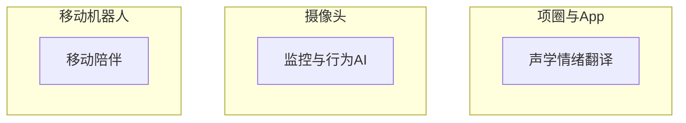
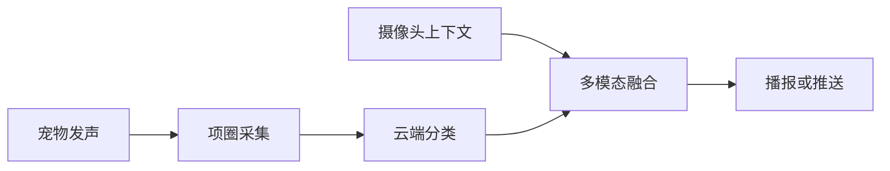

# [产品/课题名称]：技术融合科普报告

> 调研信息截止：YYYY-MM-DD | 分析师立场：[读取调研基调.md] | 读者：[读取调研基调.md]

---

<!-- 撰写说明：复制本文件结构到 $PROJECTS_ROOT/<project_slug>/research/output/报告-科普导向.md，删除 HTML 注释块，填充 [占位符]。禁止嵌入 infographics/*.png。科普导向侧重「是什么、为什么、对我方意味着什么」，压缩路线图与资源粗估。 -->

## 执行摘要

**本节目的**：用非研发读者能理解的语言，概括技术本质、融合逻辑与对我方含义。

**必读源文件**：`决策摘要.md`、`技术分析.md`、`调研基调.md`

**填写说明**：
- 避免 jargon 堆砌；可用类比（如「麦克风 + 云端猜测器」）
- 点明**常见误解**与**更准确的表述**
- 1 段，约 150–250 字
- 须含对我方主体的含义（不可写成纯行业科普）

**推荐结构**：

很多人把 [课题产品] 理解为「[通俗误解]」。从工程角度看，它更像 **[准确类比 1]**。[我方产品] 则是 **[准确类比 2]**。二者 [互补/竞争] — 但 [争议点] 目前证据 [不足/分化]，融合时应改讲 **[推荐叙事]**。

---

## 1. [课题核心产品] 到底是什么？

**本节目的**：解构代表性产品/能力的硬件、软件、宣称与证据差距。

**必读源文件**：`调研/T0-*.md`（主对标）、`竞品分析.md`

**填写说明**：
- **硬件**：形态、关键传感器、部署方式
- **软件**：处理链路（本地/云端）、核心模型/栈（带证据）
- **宣称 vs 证据**：厂商声称 vs 独立验证/学术基线
- 用 bullet 列表，面向非研发读者
- 每个关键数字带 `[A/B/C]（信息时效：YYYY-MM）`

**推荐结构**：

[产品名]（[品牌]）是 [年份/状态] 的 [品类]（`调研/T0-*.md`）：

- **硬件**：[重量/尺寸/IP/传感清单]
- **软件**：[App/云端/模型]
- **宣称**：[核心卖点 1–2 条]
- **价格**：[定价模式]

**关键澄清**：[准确率/效果声称] 是 **[厂商自报/已验证]**。[对比学术或第三方基线]。

---

## 2. [我方主体产品] 到底是什么？

**本节目的**：让读者理解我方产品的形态、能力与边界（尤其与课题相关的传感/交互缺口）。

**必读源文件**：`调研/T2-我方-*.md` 或 `调研/T0-我方-*.md`、`技术分析.md`

**填写说明**：
- 分模块介绍硬件形态（若有）
- 列出与课题相关的**已有能力**与**明确缺口**
- 用对比句强调互补（如「看得到但听不清」）
- 1–2 段 + bullet

**推荐结构**：

[我方产品] 是 [定义]（`调研/T*-*.md`）：

- **[模块 A]**：[能力]
- **[模块 B]**：[能力]

[能力清单] [证据等级]。[但与课题相关的缺口：如近场声学/移动上下文等]。

---

## 3. 竞品格局一图读懂

**本节目的**：用赛道划分帮助读者建立市场心智模型。

**必读源文件**：`竞品分析.md`、`竞品列表.md`

**填写说明**：
- **禁止**嵌入信息图 PNG
- 用 3–4 类赛道 bullet + 可选 mermaid
- 每类给出「解决什么问题」+ 代表产品
- 点明争议度或商业验证程度

**推荐 mermaid**：

**赛道说明**：
- **[赛道 1]**：懂「[用户感知价值]」（[争议大/已验证]）
- **[赛道 2]**：懂「[价值]」（[商业案例]）
- **[赛道 3]**：懂「[价值]」（[阶段]）

---

## 4. 技术原理阐释

**本节目的**：面向非研发读者解释核心技术路径、为何多模态/某架构更合理、科学局限。

**必读源文件**：`技术分析.md`

**填写说明**：
- 用类比和简单数据流（ASCII 或 mermaid），避免公式
- 说明**单模态局限**与**融合增益**
- 引用学术基线对比厂商声称（若有）
- 区分「句子翻译」vs「意图/情绪分类」等概念
- 2–4 段

**推荐数据流（mermaid 或代码块）**：

**原理要点**：
- [单模态为何不够]
- [融合带来什么上下文]
- [与更可信技术路线（如情绪分类）的关系]

---

## 5. 融合形态：为什么 [推荐形态]？

**本节目的**：用通俗语言解释方案取舍，避免研发术语。

**必读源文件**：`决策摘要.md`（方案选项）、`技术分析.md` §4

**填写说明**：
- 对比 2–3 种形态（深度一体 vs 软件互通等）
- 每形态：**通俗解释** + **主要问题**
- 推荐形态用类比（如 Apple Watch + iPhone）
- Markdown 表替代方案对比信息图

**推荐表格**：

| 形态 | 通俗解释 | 问题 |
|------|----------|------|
| 深度一体 | [比喻] | [场景冲突/成本] |
| **软件互通（推荐）** | [比喻] | [依赖第三方等，可接受] |
| [其他] | … | … |

---

## 6. 商业上什么更站得住？

**本节目的**：用已验证商业模式对照话题热度，纠正「什么能赚钱」的误解。

**必读源文件**：`商业机会.md`、`调研/T0-*.md` §11

**填写说明**：
- 引用可规模化的商业证据（订阅、告警次数、销量等）
- 对比「好奇心红利」vs「续费刚需」
- 1–2 段，带量化数字与证据等级
- 得出科普向结论（先做什么、再考虑什么）

**推荐要点**：
- [已验证模式]：[数据 + 证据] — 用户愿意为 [价值] 付费
- [话题产品]：[预售/热度] — [好奇心/争议]，续费待观察
- **科普结论**：若 [我方] 做 [方向]，先把 **[扎实能力]** 做稳，再考虑 **[彩蛋能力]**

---

## 7. 对我方主体的含义

**本节目的**：专节回答「对产品/路线意味着什么」— 科普报告不可省略。

**必读源文件**：`决策摘要.md`

**填写说明**：
- 能力分层表（L1/L2/L3 或等价）
- **是否有必要结合** — 分场景回答（若…则…；否则…）
- 主语为我方主体；中立模式须标注
- 压缩版路线图：最多 3 行里程碑，不写详细人月

**推荐表格**：

| 层级 | 能力 | 现状/建议 |
|------|------|-----------|
| L1 | [基础能力] | [已有/规划] |
| L2 | [联动能力] | [需 PoC] |
| L3 | [增值能力] | [须 gate] |

**是否有必要结合？**
- [场景 A] → [建议]
- [场景 B] → [建议]

---

## 8. 常见误解澄清

**本节目的**： preempt 决策与传播中的典型错误认知。

**必读源文件**：`竞品分析.md`、`技术分析.md`、各调研 §6/§12

**填写说明**：
- 4–6 条，格式：**「误解」** → 正解 + 简要依据
- 可含历史产品参照（标 `历史参照，非现状`）

**推荐结构**：

1. **「[误解 1]」** → [正解]；[依据]
2. **「[误解 2]」** → [正解]；[依据]
3. **「[误解 3]」** → [正解]；[依据]
4. **「[历史类比]」** → [说明娱乐向/技术局限]；`历史参照，非现状`

---

## 附录：术语与证据

**本节目的**：降低非专业读者阅读门槛。

**填写说明**：
- 3–6 个关键术语一句话解释
- 证据截止日与完整数据路径

**术语**：
- **[术语 1]**：[解释]
- **[术语 2]**：[解释]

证据截止：YYYY-MM-DD。完整数据见 `$PROJECTS_ROOT/<project_slug>/research/`。
